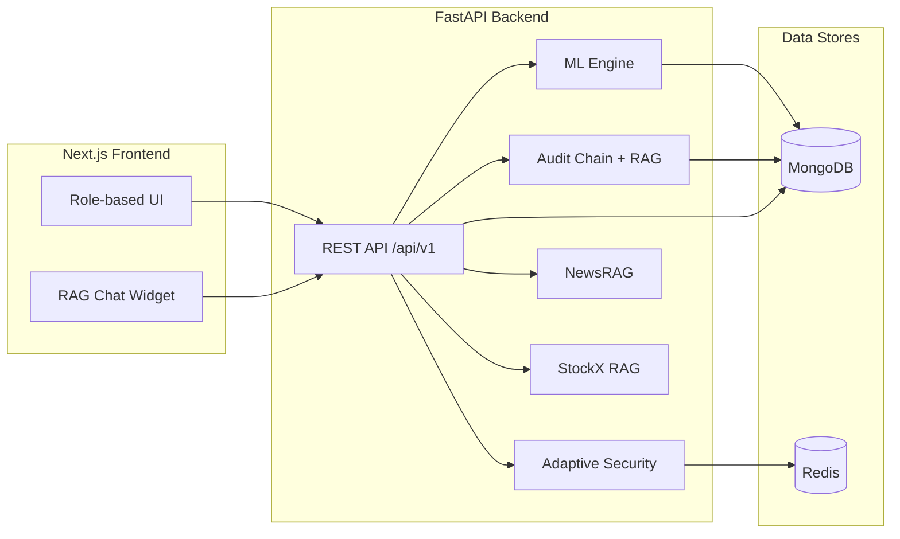

# TradeFinlytix

AI-powered trading intelligence platform for the Pakistan Stock Exchange (PSX). This repository contains a FastAPI backend (ML, security, audit, and RAG) and a Next.js frontend (role-based dashboards and workflows).

If you are looking for backend-only or frontend-only details, see these dedicated docs:

- backend README: backend/README.md
- frontend README: frontend/README.md

This README is the full, end-to-end system specification and implementation guide.

## Table of contents

- Overview
- Feature matrix
- Architecture
- Repository layout
- Backend
  - App lifecycle and middleware
  - Configuration and environment variables
  - Authentication and sessions
  - RBAC and permissions
  - API routes
  - ML prediction pipeline
  - Market data
  - Screener engine
  - Portfolio and trades
  - Alerts
  - Admin and CISO operations
  - Audit chain and RAG search
  - Core RAG module
  - StockX RAG pipeline
  - NewsRAG pipeline
  - Security controls
  - Data storage and indexes
  - Scripts and tests
  - Background workers
- Frontend
  - App runtime and providers
  - Routing and pages
  - Shared components
  - Data fetching
  - Theming
- Setup and run
  - Local backend
  - Local frontend
  - Docker compose
  - RAG and NewsRAG prerequisites
- Known gaps and placeholders
- Team

## Overview

TradeFinlytix delivers PSX trading intelligence with four core pillars:

- Predictive signals from a stacked ML ensemble (XGBoost, LightGBM, LSTM)
- Explainability via SHAP feature attribution
- Adaptive security with anomaly detection and tamper-evident audit logs
- Retrieval-augmented generation (RAG) for platform knowledge and audit search

The system is role-aware and ships dedicated dashboards for investors, admins, and CISOs.

## Feature matrix

Investor

- AI buy/hold/trim/sell signals for any PSX symbol
- Confidence score, targets, stop-loss, and time horizon
- Portfolio snapshot and encrypted trade history
- Alerts for prediction risk and security events

Admin

- User directory with filters
- Activate/deactivate users
- Reset user passwords
- Per-user activity view (audit logs)

CISO

- Audit log explorer with pagination
- Tamper-evident chain verification
- Anomaly log viewer and stats
- Risk snapshot history and trends
- Natural language audit search (RAG over audit logs)

AI and data

- 59-feature technical pipeline from yfinance OHLCV
- Stacked ensemble model with meta-learner
- SHAP attributions for top factors
- StockX RAG pipeline with FAISS index and query routing
- NewsRAG pipeline for PSX announcements with Self-RAG evaluators

## Architecture



## Repository layout

```
TradeFinlytix/
  README.md
  backend/
    app/
      api/
      core/
      ml_engine/
      NewsX/
      rag/
        embedder.py
        retriever.py
        rag_service.py
      repositories/
        audit_chain_state.py
      schemas/
      security/
        anomaly_detection.py
        csrf.py
        hmac_signing.py
        input_validator.py
        rate_limiter.py
        security_alerts.py
        security_orchestrator.py
        zscore_detection.py
      services/
      StockX/
      utils/
      workers/
        alert_worker.py
        data_collector.py
        scheduler.py
    scripts/
    tests/
    docker-compose.yml
    Dockerfile
    requirements.txt
  frontend/
    public/
    src/
      app/
      components/
      lib/
      providers/
    package.json
    tailwind.config.ts
```

Other directories of note:

- backend/trade/ is a local Python venv directory
- backend/zap-reports/ and frontend/zap-reports/ store security scan output

## Backend

### App lifecycle and middleware

The backend entrypoint is backend/app/main.py. Key startup steps:

- Structured logging setup
- MongoDB connect and index creation
- HTTP client initialization
- Audit chain verification (optional)
- Bootstrap admin and CISO accounts (optional)
- Ensemble model pre-load

Middleware and safety layers:

- CORS with allowlist from settings
- Optional CSRF enforcement for mutating requests
- Audit chain safety guard (blocks /admin, /ciso, /predict when chain is untrusted)
- Request logging with X-Request-ID header

Health endpoints:

- GET /health (no DB hit)
- GET /health/db (ping MongoDB)
- OpenAPI docs are exposed at /docs and /redoc only when EXPOSE_OPENAPI=true

### Configuration and environment variables

Settings are defined in backend/app/core/config.py via Pydantic Settings. Key groups:

- App: APP_NAME, APP_ENV, DEBUG, EXPOSE_OPENAPI
- Server: HOST, PORT
- MongoDB: MONGODB_URI, MONGODB_DB_NAME
- Redis: REDIS_URL, RATE_LIMIT_REQUESTS, RATE_LIMIT_WINDOW_SECONDS
- Auth and JWT: JWT_SECRET_KEY, JWT_ALGORITHM, ACCESS_TOKEN_EXPIRE_MINUTES, REFRESH_TOKEN_EXPIRE_DAYS
- OTP and lockout: AUTH_LOCKOUT_FAILED_ATTEMPTS, AUTH_LOCKOUT_MINUTES, PASSWORD_RESET_OTP_* settings
- Crypto: AES_SECRET_KEY (32 bytes), HMAC_SECRET_KEY
- CORS: ALLOWED_ORIGINS
- RAG: GROQ_API_KEY, OPENAI_API_KEY
- Audit chain: AUDIT_STARTUP_VERIFY_CHAIN, AUDIT_REJECT_NEW_EVENTS_WHEN_CHAIN_UNTRUSTED
- Bootstrap: ENABLE_BOOTSTRAP and BOOTSTRAP_* credentials
- Security alert webhook: SECURITY_ALERT_WEBHOOK_URL

Strict validation:

- JWT_SECRET_KEY must be set (cannot contain CHANGE_THIS)
- AES_SECRET_KEY must be exactly 32 bytes
- Risk thresholds must satisfy 0 <= medium < high < critical <= 100

### Authentication and sessions

Auth flows are implemented in backend/app/api/routes/auth.py and backend/app/services/auth_service.py.

- Register: POST /api/v1/auth/register
- Login: POST /api/v1/auth/login
- Refresh: POST /api/v1/auth/refresh
- Logout: POST /api/v1/auth/logout
- Logout all: POST /api/v1/auth/logout-all
- Me: GET /api/v1/auth/me
- Password reset: POST /api/v1/auth/forgot-password
- Resend OTP: POST /api/v1/auth/forgot-password/resend
- Verify OTP: POST /api/v1/auth/forgot-password/verify-otp
- Reset password: POST /api/v1/auth/forgot-password/reset

Security details:

- JWT access tokens and refresh tokens are signed with python-jose
- Refresh tokens are stored hashed and revoked on logout or rotation
- Account lockout after repeated failed logins
- Password reset uses short-lived OTPs stored in MongoDB
- Email is encrypted at rest and hashed for lookup
- Logout all increments jwt_version to revoke existing access tokens
- Refresh token misuse is recorded as audit events

### RBAC and permissions

Role types:

- investor
- admin
- ciso

Permission matrix (backend/app/core/roles.py):

- investor: predict:read, portfolio:read, portfolio:write, alerts:read, alerts:write, screener:read
- admin: predict:read, portfolio:read, alerts:read, alerts:write, screener:read, admin:read, admin:write, audit:read, users:read, users:write
- ciso: predict:read, alerts:read, audit:read, audit:write, anomaly:read, users:read, admin:read

Dependencies:

- get_current_user validates JWT, jwt_version, and active status
- require_permission enforces the permission matrix

### API routes

Base prefix: /api/v1

Auth

- POST /auth/register
- POST /auth/login
- POST /auth/refresh
- POST /auth/logout
- POST /auth/logout-all
- GET /auth/me
- POST /auth/forgot-password
- POST /auth/forgot-password/resend
- POST /auth/forgot-password/verify-otp
- POST /auth/forgot-password/reset

Prediction

- GET /predict/{symbol}
- POST /predict/verify-integrity

Portfolio

- GET /portfolio
- PUT /portfolio
- POST /portfolio/trades
- GET /portfolio/trades

Alerts

- GET /alerts
- PATCH /alerts/{alert_id}/read
- PATCH /alerts/read-all
- GET /alerts/unread-count

Screener

- POST /screener

Market

- GET /market/intraday

Admin

- GET /admin/users
- GET /admin/users/{user_id}
- POST /admin/users/{user_id}/deactivate
- POST /admin/users/{user_id}/activate
- POST /admin/users/{user_id}/reset-password
- GET /admin/users/{user_id}/activity

CISO

- GET /ciso/audit
- GET /ciso/audit/logs
- GET /ciso/audit/verify
- GET /ciso/anomalies
- GET /ciso/anomalies/stats
- GET /ciso/risk/snapshots
- GET /ciso/risk/trend
- GET /ciso/risk/top
- GET /ciso/risk/recent
- POST /ciso/audit/search

RAG

- POST /rag/query
- GET /rag/health

NewsRAG

- POST /news-rag/query
- POST /news-rag/parse-preview
- GET /news-rag/health

System

- GET /health
- GET /health/db

### ML prediction pipeline

The prediction flow is driven by backend/app/ml_engine/ensemble_predict.py and backend/app/ml_engine/models/ensemble_model.py.

1. Live data fetch
   - yfinance 2-year OHLCV data
   - PSX symbols are retried with .KA suffix
   - 5-minute OHLCV cache in memory

Input validation and errors:

- Symbol must match ^[A-Z0-9._-]+$ after uppercasing
- Market data failures return HTTP 502
- When the ensemble is not loaded or inference fails, a neutral fallback is returned

2. Feature engineering (59 features)
   - Implemented in backend/app/ml_engine/features/feature_engineering.py
   - Feature order is fixed to match training

Full feature list:

```
close_open_ratio
high_low_range
upper_wick
lower_wick
body_size
return_1d
return_5d
return_10d
return_20d
return_60d
return_120d
log_return_1d
price_to_sma20
price_to_ema26
sma5_cross_sma20
rsi_14
roc_10
williams_r_14
stoch_k
stoch_d
bb_width
bb_pct
atr_pct
volatility_5d
volatility_10d
volatility_20d
volume_ratio
lag_return_1d
lag_return_2d
lag_return_3d
lag_return_4d
lag_return_5d
day_of_week
month
quarter
is_month_end
is_quarter_end
overnight_gap
direction_streak
sharpe_5d
sharpe_20d
return_1d_xrank
return_5d_xrank
return_20d_xrank
return_60d_xrank
rsi_14_xrank
stoch_k_xrank
bb_pct_xrank
volume_ratio_xrank
atr_pct_xrank
volatility_20d_xrank
market_return_1d
market_breadth
market_vol
macd_pct
macd_signal_pct
macd_hist_pct
obv_zscore
```

3. Base learners

- XGBoost (xgb_model.pkl)
- LightGBM (lgb_model.pkl)
- LSTM (lstm_model.keras)

4. Meta-learner

- Logistic regression meta model (meta_learner.pkl)
- StandardScaler for stacked inputs (meta_scaler.pkl)

5. Outputs and thresholds

Confidence thresholds in backend/app/ml_engine/ensemble_predict.py:

- confidence >= 0.65 -> buy
- confidence >= 0.55 -> hold
- confidence >= 0.45 -> trim
- confidence < 0.45 -> sell

Each response includes:

- signal and confidence
- entry_price, target_price, stop_loss
- expected_gain_pct and time_horizon_days
- base model scores
- SHAP explanation (when available)
- model_version and engine (ensemble_v1 or fallback)

6. Explainability

SHAP TreeExplainer for XGBoost and LightGBM. Explanation block includes:

- method
- base_value
- top_features (feature name, shap_value, feature_value, direction)

7. Integrity

Responses include HMAC-SHA256 signature. POST /predict/verify-integrity checks it.

### Market data

Public intraday endpoint:

- GET /market/intraday?symbols=OGDC,HBL&interval=1m&limit=60

Implementation details:

- yfinance intraday data with 55-second cache
- Valid intervals: 1m, 2m, 5m, 15m, 30m, 60m
- Symbols are validated to allow letters, digits, dot, underscore, hyphen

### Screener engine

Endpoint:

- POST /screener

Implementation details:

- Rule-based scoring over live features
- Presets: custom, growing, low_risk, trending
- Default universe is a small US liquid list (AAPL, MSFT, NVDA, TSLA, AMZN, GOOGL, META, SPY)
- Trend logic uses return_20d, SMA cross, and price_to_sma20

### Portfolio and trades

Endpoints:

- GET /portfolio
- PUT /portfolio
- POST /portfolio/trades
- GET /portfolio/trades

Storage:

- Portfolio positions and metadata are AES-256-GCM encrypted
- Trades are AES-256-GCM encrypted

### Alerts

Endpoints:

- GET /alerts
- PATCH /alerts/{alert_id}/read
- PATCH /alerts/read-all
- GET /alerts/unread-count

Implementation details:

- Alerts are stored in MongoDB and auto-expire after 30 days
- High or critical risk predictions trigger alerts
- Security alerts are de-duplicated within 60 seconds

### Admin and CISO operations

Admin operations:

- Paginated user list with filters
- Activate/deactivate user (cannot target admin or ciso accounts)
- Reset password and invalidate sessions
- User activity from audit logs

CISO operations:

- Audit log listing with pagination
- Audit chain verification
- Anomaly logs and daily stats
- Risk snapshot listing and trend buckets
- Top risky subjects and recent critical events
- Audit RAG search: natural language over embedded audit logs

### Audit chain and RAG search

Audit chain:

- Each audit log includes prev_hash and chain_hash
- AuditRepository.verify_chain replays the chain to detect tampering
- When strict mode is enabled and chain is untrusted, sensitive endpoints are blocked
- backend/app/repositories/audit_chain_state.py holds a process-local boolean flag that tracks whether the chain is currently trusted. set_audit_chain_trusted is called at startup after verification, and audit_chain_append_allowed is checked before every record() call so that new log writes become no-ops when the chain is known to be broken.

Embeddings:

- Each audit log is embedded using the sentence-transformers model from anomaly detection
- Embeddings are stored in audit_logs.embedding
- search_logs uses cosine similarity over a candidate set and returns top_k

Audit RAG search:

- POST /ciso/audit/search
- Builds context from top-K log rows
- Calls Groq Chat Completions with llama-3.3-70b-versatile
- Returns answer plus sources

### Core RAG module

The shared RAG infrastructure lives in backend/app/rag/ and is used by the audit search flow (POST /ciso/audit/search). It is not the StockX pipeline, which has its own directory.

backend/app/rag/embedder.py

- Converts an audit log document into a text string (event_type, user_id, ip, path, payload)
- Encodes it with the same sentence-transformers all-MiniLM-L6-v2 model used by anomaly detection, producing a normalised float vector

backend/app/rag/retriever.py

- store_embedding: runs embed_log_document in a thread executor and upserts the vector into audit_logs.embedding via MongoDB $set
- search_logs: embeds the query text, streams up to 500 candidate documents from audit_logs (those that have an embedding field), scores each by cosine similarity, and returns the top_k documents sorted by score. Embeddings are stripped from results; a _score field is added.

backend/app/rag/rag_service.py

- answer_query: calls search_logs to retrieve relevant log rows, formats them into a single context block (timestamp, event_type, user_id, ip, path, score), then calls Groq llama-3.3-70b-versatile with a security-analyst system prompt. Returns answer and the raw source documents.

### StockX RAG pipeline

The general RAG endpoint is /rag/query. The pipeline lives in backend/app/StockX/query.py.

Models and embeddings:

- ChatGroq llama-3.1-8b-instant for routing and query transforms
- OpenAI gpt-4o-mini for final answer generation
- OpenAI text-embedding-3-small for embeddings

Vector store:

- FAISS index at backend/app/StockX/faiss_vectorstore
- If loading fails, an empty FAISS index is created

Query techniques (router selects up to 3):

- rewrite
- step_back
- multi_query
- hyde
- decompose
- rag_fusion

Contextual compression removes irrelevant chunks before answer generation.

Prediction tool integration:

- If a query looks like a stock prediction request, the pipeline calls GET /predict/{symbol}
- Symbol extraction is handled by a Groq LLM prompt with explicit PSX ticker rules
- A service token is obtained via bootstrap admin credentials

### NewsRAG pipeline

NewsRAG provides PSX company announcement intelligence with a Self-RAG pipeline.

Endpoints:

- POST /news-rag/query
- POST /news-rag/parse-preview
- GET /news-rag/health

Implementation details:

- Parses ticker and result count from a natural language question
- Runs a subprocess to avoid Playwright and anyio event-loop conflicts
- Self-RAG steps: IsRel, IsSup, IsUse evaluators plus a final briefing
- Uses OpenAI for the evaluator prompts
- Scrapes PSX announcements and can download PDF reports
- Returns a downloadable .txt report

### Security controls

Core security features:

- AES-256-GCM encryption for sensitive fields
- HMAC-SHA256 signing for prediction payload integrity
- JWT auth with refresh token rotation
- Role-based access control
- Adaptive rate limiting based on risk level
- Behavioral anomaly detection
- Z-score request-rate spikes
- Optional CSRF protection
- Structured logging and security alert webhook

backend/app/security/rate_limiter.py

- Redis sorted-set sliding-window limiter exposed as a FastAPI dependency (Depends(rate_limit))
- Per-IP key; window and max-request count come from settings (RATE_LIMIT_REQUESTS, RATE_LIMIT_WINDOW_SECONDS)
- Returns HTTP 429 when the count exceeds the threshold

backend/app/security/zscore_detection.py

- Redis-backed rolling z-score over per-user per-minute request counts
- record_and_score appends a value to a capped list in Redis and returns (z_score, is_anomaly) where anomaly is flagged when abs(z) >= zscore_threshold
- request_rate_zscore is called per request: it increments the current-minute bucket counter and, on the first hit of each new minute, scores the previous minute's count against the rolling history
- Window size and threshold are configurable via settings (ZSCORE_WINDOW_SAMPLES, ZSCORE_THRESHOLD)

backend/app/security/security_alerts.py

- emit_security_alert logs at CRITICAL level and optionally POSTs to SECURITY_ALERT_WEBHOOK_URL with up to 3 retries and 0.5 s back-off
- Log payloads are sanitised by redact_security_log_payload, which truncates chain digest fields to prevent full hash leakage in log aggregators
- Fire-and-forget: failures are swallowed and never propagate to request handlers

Adaptive security scoring (backend/app/security/security_orchestrator.py):

- Factors include failed logins, sensitive path access, anonymous sensitive access, rate spikes, and anomaly score
- Risk thresholds are configurable
- Medium and high risk apply tighter rate limits
- Critical risk blocks the request with HTTP 403
- High risk marks request.state.high_risk and triggers alerts

Anomaly detection (backend/app/security/anomaly_detection.py):

- Sentence-transformers all-MiniLM-L6-v2
- IsolationForest on combined behavioral + semantic vector
- Fallback to centroid distance and rule-based scoring

### Data storage and indexes

Collections and key usage:

- users: encrypted emails, roles, auth metadata
- refresh_tokens: hashed refresh tokens with TTL
- password_reset_otps: OTP records with TTL
- predictions: encrypted prediction payloads
- portfolio: encrypted portfolio snapshots
- transactions: encrypted trade entries
- alerts: alert records with TTL
- audit_logs: hash-chained audit events with TTL and embeddings
- anomaly_logs: anomaly entries with TTL
- risk_snapshots: risk events with TTL
- psx_eod, psx_intraday, sentiment_raw, sentiment_daily: data caches and history

Indexing and TTL policies are created at startup in backend/app/core/database.py.

Index highlights:

- users.email_hash is unique (partial index)
- alerts, audit_logs, anomaly_logs use 30-day TTL on created_at
- refresh_tokens and password_reset_otps use expires_at TTL
- risk_snapshots uses 90-day TTL on created_at

### Scripts and tests

Scripts (backend/scripts):

- pentest_smoke.py: quick security smoke checks
- migrate.py: placeholder
- seed_db.py: placeholder
- train_model.py: placeholder

Tests (backend/tests):

- Auth flows
- Prediction pipeline
- Ensemble model
- Anomaly detection
- Screener
- Portfolio
- Admin routes
- Security edge cases
- Password policy (test_password_policy.py): validates the 72-byte bcrypt hard limit and password strength rules in app/utils/helpers.py

backend/tests/seed.py is a test-only helper that pre-populates the database with fixture data used by integration tests.

### Background workers

The backend/app/workers/ directory is reserved for background job processes. All three files are currently placeholders:

- alert_worker.py: intended for async alert dispatch (pushing alerts to users outside the request cycle)
- data_collector.py: intended for scheduled market data ingestion (PSX OHLCV snapshots, sentiment feeds)
- scheduler.py: intended for APScheduler or similar job scheduling wiring

These are listed in Known gaps and placeholders below.

## Frontend

### App runtime and providers

The Next.js app uses:

- AuthProvider for session state
- React Query for data fetching and caching
- RagChatWidget injected in the root layout

### Routing and pages

Public:

- /: marketing and entry point

Auth:

- /login
- /register
- /forgot-password

Protected (role gated by ProtectedShell):

- /dashboard
- /predict
- /predict/[symbol]
- /portfolio
- /trades
- /profile
- /admin/users
- /admin/users/[userId]
- /ciso/audit
- /ciso/risk

### Shared components

- ProtectedShell: navigation, alert bell, role gating, mobile nav
- PsxLiveChartCard: intraday PSX chart using /market/intraday
- RagChatWidget: conversational UI calling /rag/query
- ThemeToggle: toggles normal vs tfx-mono (green-on-black) mode

### Data fetching

The frontend uses Axios and React Query. All API calls target NEXT_PUBLIC_API_BASE_URL + /api/v1. The implementation is split across four files in frontend/src/lib/:

frontend/src/lib/api.ts

- Creates and exports the shared Axios instance (api) with the base URL and Content-Type header
- Manages accessToken and refreshToken in module scope, mirrored to localStorage under the keys tfx_access_token and tfx_refresh_token
- Request interceptor attaches the Bearer token to every request
- Response interceptor automatically retries a failed request once after refreshing via POST /auth/refresh on 401; subsequent 401s are passed through

frontend/src/lib/queries.ts

- All React Query hooks for the app, grouped by domain:
  - Predictions: useMarketPrediction
  - Portfolio: usePortfolio, useTrades
  - Admin: useAdminUsers, useAdminUser, useAdminUserActivity
  - CISO audit: useAudit, useAuditLogs, useAuditVerify
  - CISO anomalies: useAnomalies, useAnomalyStats
  - CISO risk: useRiskTrend, useTopRisk, useRiskRecent, useRiskSnapshots
  - Alerts: useAlerts, useUnreadAlertCount (both poll every 30 s)
  - Screener: useScreener
  - Market: usePsxIntraday (polls every 60 s, stale after 55 s)

frontend/src/lib/types.ts

- Shared TypeScript types: Role (investor | admin | ciso), UserPublic, TokenResponse

frontend/src/lib/utils.ts

- cn(): merges Tailwind class strings via clsx and tailwind-merge

### Theming

- Default theme: light, green accents
- Mono theme: black background with green text
- Toggle stored in localStorage key tfx_theme

### Mock data behavior

Several pages render mock data when the backend is unavailable. Examples include:

- Dashboard cards and charts
- Predict list and predict details
- Portfolio positions
- Trades list
- Admin and CISO pages

This allows UI demos without a live backend, but should not be confused with real data.

## Setup and run

### Local backend

From the repository root:

```bash
cd backend
python -m venv venv
venv\Scripts\activate  # Windows
pip install -r requirements.txt
uvicorn app.main:app --reload --host 0.0.0.0 --port 8000
```

### Local frontend

```bash
cd frontend
npm install
npm run dev
```

Frontend runs on http://localhost:3000

### Docker compose

```bash
cd backend
docker compose up --build
```

Services:

- API: http://localhost:8000
- Docs: http://localhost:8000/docs
- MongoDB: localhost:27017
- Redis: localhost:6379
- Mongo Express: http://localhost:8081

### RAG and NewsRAG prerequisites

StockX RAG:

- GROQ_API_KEY (for routing and query transforms)
- OPENAI_API_KEY (for gpt-4o-mini and embeddings)
- FAISS index present at backend/app/StockX/faiss_vectorstore

NewsRAG:

- OPENAI_API_KEY
- playwright installed: playwright install chromium

## Known gaps and placeholders

These files exist but are placeholders or not wired to live routes:

- backend/app/api/routes/audit.py
- backend/app/security/input_validator.py
- backend/app/ml_engine/utils/atr_levels.py
- backend/app/utils/constants.py
- backend/app/utils/decorators.py
- backend/app/repositories/stock_repo.py
- backend/app/schemas/stock_schema.py
- backend/scripts/migrate.py
- backend/scripts/seed_db.py
- backend/scripts/train_model.py
- backend/app/workers/alert_worker.py
- backend/app/workers/data_collector.py
- backend/app/workers/scheduler.py

Frontend gaps:

- The profile page calls /auth/change-password, which is not implemented in the backend

Operational notes:

- Screener defaults to a US symbol universe, not PSX
- NewsRAG is not connected to any frontend page

## Team

| Name | Roll No |
|------|---------|
| Aleena Ahmed | DS-09 |
| Seerat Fatima | DS-32 |
| Toqir Dar | DS-34 |
| Ayan Ahmed | DS-40 |

---

## License

This project is licensed under the [MIT License](LICENSE).

---

*TradeFinlytix — bringing institutional-grade AI to the Pakistan Stock Exchange.*
